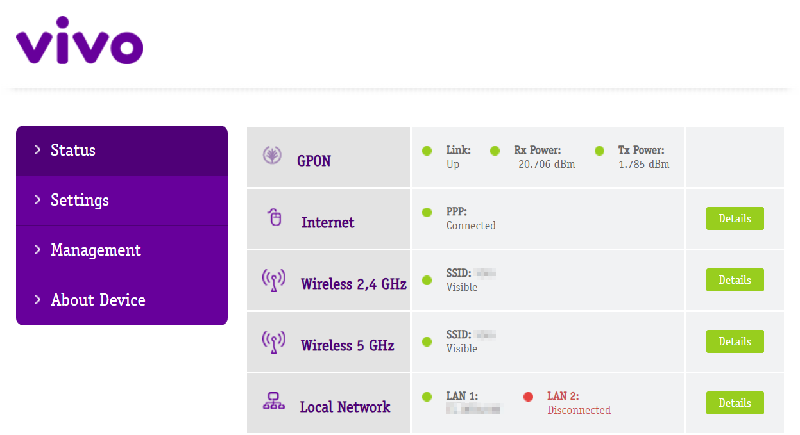

# Vivo Box Extractor [ Under development ]

A program to extract, digest, save, and visualize data from a **Vivo Box** network router.

## Operation

This program prints the router's internal variables and their content on startup, one per line, then it runs continuously, only printing variables when they are changed. After downloading the repository it can be executed with:

```
node index.js
```

## Arguments

```
--only-status      Only extract status variables, disabling statistics
--only-statistics  Only extract statistics variables, disabling status
--debug            Prints execution logs to standard error pipe (stderr)
--skip-start       Disables printing of initial variables on start
--date             Adds the current date (in local time) to the beggining of the line
```

## Configuration

The program can be configured by an `.env` file or environment variables

The variables used by this are listed at the [./lib/0-primitive/loadConfig.js](./lib/0-primitive/loadConfig.js) file

## Output data

The internal router variables are printed one per line: Each line printed to the standard output starts with the variable name and an equal character (=) followed by the content of the variable in raw text. The program executes continuously, printing variables when they update.

## Dependencies

This project is executed by [node.js](https://nodejs.org/) (tested on v20.10.0) and it must be installed for it to work.

It does not use npm packages at the moment. Running `npm install` is not necessary.

I developed this repository to work on the router of model *RTF3505VW-N2* when it uses the software of model *Vivo Box BR_SV_g000_R3505VWN1001_s42*, the interface dashboard it provides is this:



## Motivation

Keeping track of the status and usage of your network is useful, and any good sysadmin must do it, but as a Computer Engineer gratuate I learned how to do that in specialized routers or dedicated Linux machines that snooped the network or talked to other linux machines to aggregate this data.

In my case I needed to get data straight from the source: The network router. My network provider installed a router that displays its current status: fiber optical signal stregth, connected devices, configured routing, properties of interfaces, and the most useful information of all: the amount of bytes sent and received from _each interface_.

However, the current status is only about this very instant: there's no information about change, like speed and variables from the past which limits how much useful it is.

I decided to reverse-engineer my personal router and analyze its internal communication protocol to create this project: A program to extract, parse, digest, transform, save, and visualize the router information in ways I felt would be useful.

I also self-host some hobby projects like my personal blog (https://grossato.com.br/) and other services so tracking usage and downtime is useful to make sure they work.
